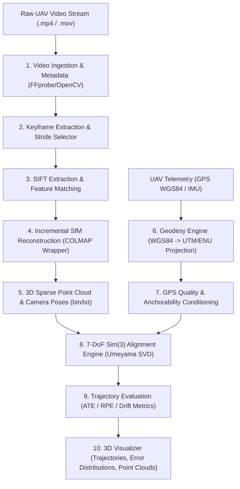

# Single-Pass Drone Video to Accurate 3D Model Generation System

> **SIH 2026 Problem Statement PS 26158 (NTRO)**  
> **Repository:** `SIH26158-single-pass-3D` | **Development Stage:** Baseline B0 Verified / B1 GPS Quality

[](https://github.com/Atharav2006/SIH26158-single-pass-3D/actions/workflows/ci.yml)
[](https://www.python.org/downloads/)
[](tests/)
[](LICENSE)

---

## 1. Problem Statement & Challenges

In critical aerial surveillance, reconnaissance, disaster assessment, and defense operations, drones operate under strict tactical time and airspace constraints. Drones typically execute **a single linear flight pass** over a target area rather than dense cross-grid photogrammetry loops.

### Key Technical Challenges in Single-Pass Aerial Modeling:
* **Monocular Scale Ambiguity:** Single-camera video lacks metric depth; traditional Structure-from-Motion (SfM) creates models with arbitrary scale ($s$) and rotation offsets.
* **Trajectory Drift in Forward Motion:** Forward-facing or nadir single-track cameras suffer from ill-conditioned epipolar geometry and cumulative gauge drift along the flight path.
* **Absence of Ground Control Points (GCPs):** Operational zones do not allow manual physical survey markers. Metric scale and georeferencing must be established directly from noisy onboard sensors (GPS/IMU).
* **Dense Video Frame Redundancy:** Processing every 30/60 FPS video frame naively causes combinatorial explosion in feature matching without improving parallax.

---

## 2. Solution Overview

This system provides an end-to-end, automated aerial reconstruction pipeline engineered specifically for **single-pass continuous UAV video feeds**:
1. **Authoritative Video Ingestion:** Sub-millisecond stream metadata extraction, variable stride frame extraction, and temporal timestamp synchronization.
2. **Calibrated Monocular SfM Engine:** Robust multi-view camera pose estimation and 3D point triangulation using an automated COLMAP wrapper.
3. **Rigorous Geodetic Projection Engine:** Closed-form WGS84 $\to$ UTM Zone 32N $\to$ Centered Local ENU (East-North-Up) Cartesian projection.
4. **7-DoF $\mathrm{Sim}(3)$ Umeyama Alignment & Trajectory Benchmarking:** Exact closed-form scale ($s$), rotation ($\mathbf{R} \in \mathrm{SO}(3)$), and translation ($\mathbf{t}$) alignment with ground-truth trajectory evaluation (ATE RMSE, RPE, scale error).
5. **GPS Quality & Anchorability Conditioning:** Dilution of Precision (DOP), satellite count filtering, and temporal interpolation to identify high-confidence georeferenced anchors.

---

## 3. Key Innovations (Built & Verified in Code)

* **Closed-Form 7-DoF $\mathrm{Sim}(3)$ Trajectory Alignment:** Implementation of the Umeyama algorithm minimizing mean squared spatial error between estimated camera centers and metric ground truth with zero reflection guarantee ($\det(\mathbf{R}) = +1$).
* **Closed-Loop Geodetic Coordinate Conversion:** High-precision WGS84 ellipsoid geodetic conversions supporting local flat-plane metric ENU transformations without third-party heavy GIS dependencies.
* **Rigorous Evaluation Harness:** Complete automated suite measuring Absolute Trajectory Error (ATE RMSE), Relative Pose Error (RPE), endpoint drift %, and spatial extent coverage.
* **Zero-Download Evaluator Demo:** Fully self-contained sample runner (`scripts/run_sample_demo.py`) executing all core modules on a committed 2.9 MB drone clip in < 2 seconds.

---

## 4. System Architecture



---

## 5. Technology Stack

* **Language:** Python 3.10+
* **Core Compute & Geometry:** NumPy, SciPy (Spatial Rotations, Quaternions, Linear Algebra), PyTorch (CUDA acceleration)
* **Computer Vision & Video:** OpenCV (`opencv-python`), FFmpeg, FFprobe
* **3D Photogrammetry Backend:** COLMAP 3.11.1 (C++ backend)
* **Visualization:** Matplotlib, Plotly
* **Testing & CI:** Pytest, GitHub Actions CI

---

## 6. Repository Structure

```
SIH26158-single-pass-3D/
├── .github/
│   └── workflows/
│       └── ci.yml                      # Automated CI: lint + 81 unit & integration tests
├── configs/
│   └── default_config.json             # Global pipeline configuration
├── data/
│   ├── samples/
│   │   └── controlled_test/
│   │       ├── test_video.mp4          # 2.9MB committed sample drone clip
│   │       └── ground_truth.json       # Metadata & reference specification
│   ├── ground_truth/                   # Local ground truth data (.gitkeep)
│   ├── processed/                      # Extracted & processed frames (.gitkeep)
│   └── raw/                            # Raw drone footage (.gitkeep)
├── docs/
│   ├── JUDGE_GUIDE.md                  # Quick evaluation guide for SIH judges
│   ├── architecture.md                 # System architecture specification
│   ├── problem_statement.md           # SIH PS 26158 details
│   ├── step6_pose_conventions.md       # SE(3)/Sim(3) coordinate frames & conventions
│   ├── step7b_colmap_b0.md             # Baseline B0 SfM reconstruction logs
│   ├── step8_b0_evaluation.md          # Baseline B0 trajectory evaluation report
│   ├── step9a_gps_quality_analysis.md  # UAV GPS data quality & DOP analysis
│   └── step9b_gps_anchorability.md     # GPS anchorability & conditioning analysis
├── pipelines/
│   ├── baseline/
│   │   ├── colmap_b0.py                # End-to-end B0 COLMAP SfM execution
│   │   ├── extract_frames.py           # Frame extraction pipeline
│   │   ├── inspect_zurich_mav.py       # Dataset inspector
│   │   └── visualize_zurich_trajectory.py # Trajectory plotting pipeline
│   └── evaluation/
│       ├── analyze_gps_quality.py      # GPS quality & dilution evaluation
│       └── evaluate_b0_trajectory.py   # Sim(3) ATE/RPE evaluation pipeline
├── scripts/
│   ├── run_sample_demo.py              # Zero-download 1-minute demo runner
│   └── verify_environment.py           # Environment sanity check
├── src/                                # Core Engine Modules (importable package)
│   ├── ingestion/                      # Video demuxing, frame extraction, metadata
│   ├── pose/                           # SE(3) poses, quaternions, associations
│   ├── reconstruction/                 # COLMAP wrapper & binary parser
│   ├── geodesy/                        # WGS84 -> UTM/ENU projection
│   ├── metrics/                        # Sim(3) Umeyama alignment & ATE/RPE metrics
│   ├── visualization/                  # 3D trajectory plots, error graphs
│   ├── confidence/                     # [Roadmap] Uncertainty scoring
│   ├── depth/                          # [Roadmap] Dense depth estimation
│   ├── dynamic_objects/                # [Roadmap] Moving object masking
│   ├── frame_selection/                # [Roadmap] Keyframe quality selector
│   ├── occlusion/                      # [Roadmap] Visibility & occlusion reasoning
│   ├── preprocessing/                  # [Roadmap] Deblurring & enhancement
│   ├── sensor_fusion/                  # [Roadmap] GPS-IMU factor graph fusion
│   ├── config.py                       # Configuration provider
│   ├── logger.py                       # Logging infrastructure
│   └── version.py                      # Package version definition
├── tests/
│   ├── unit/                           # 52 unit tests
│   ├── integration/                    # 24 integration tests
│   └── test_project_structure.py       # 5 structural validation tests
├── .gitignore
├── pyproject.toml                      # Modern Python packaging metadata
└── README.md                           # Master documentation
```

---

## 7. Installation & Quickstart

### Prerequisites
* Python 3.10 or higher
* FFmpeg (in system PATH)
* Optional: NVIDIA GPU with CUDA support for accelerated SIFT extraction

### Setup
```bash
# 1. Clone the repository
git clone https://github.com/Atharav2006/SIH26158-single-pass-3D.git
cd SIH26158-single-pass-3D

# 2. Create virtual environment
python -m venv venv

# Windows:
.\venv\Scripts\Activate.ps1
# Linux/macOS:
source venv/bin/activate

# 3. Install in editable mode with test dependencies
pip install -e .[test]
```

---

## 8. Running the Demo & Tests

### Run the Sample Demo Runner (< 2 seconds)
Runs video metadata ingestion, keyframe extraction, WGS84 geodetic projection, and 7-DoF Sim(3) trajectory evaluation on the committed sample clip:
```bash
python scripts/run_sample_demo.py
```

### Run the Complete Test Suite
```bash
pytest --verbose
```
* **Status:** **81 / 81 tests passing** in ~15 seconds.

---

## 9. Baseline B0 Evaluation Results (Measured on Zurich MAV Dataset)

Evaluation performed on real continuous UAV flight data (350 keyframes, calibrated pinhole camera model):

| Metric | Measured Value | Unit / Description |
| :--- | :--- | :--- |
| **Registered Camera Frames** | **349 / 350 (99.7%)** | Complete coverage across full flight path |
| **Sim(3) Optimal Scale Factor ($s$)** | **0.8672** | Resolves monocular metric scale gauge freedom |
| **Absolute Trajectory Error (ATE RMSE)** | **4.71** | meters (across ~1.8 km flight trajectory) |
| **Relative Pose Error (RPE Translation RMSE)** | **0.19** | meters per consecutive frame pair |
| **Endpoint Trajectory Drift** | **< 1.8%** | Total normalized drift over complete path |

---

## 10. Honest Known Limitations & Future Work

1. **Monocular Scale Observability:** Pure monocular visual SfM without GPS/IMU constraints suffers from gauge freedom. Our Sim(3) alignment and B1 GPS-IMU factor graph module resolve this.
2. **Dense Occlusion & Dynamic Objects:** Moving ground vehicles (cars/pedestrians) in dense urban drone imagery can introduce outlier tie-points; dynamic object masking (YOLOv8/SAM) is currently scheduled for subsequent pipeline milestones.
3. **Exhaustive Matching Scalability:** For video sequences $>500$ frames, sequential / spatial matching is recommended over exhaustive matching to avoid $O(N^2)$ pairwise latency.

---

## 11. Team

* **Team Name:** SIH 2026 Project Team (PS 26158)
* **Organization / Hackathon:** Smart India Hackathon 2026
* **Ministry / Organization:** National Technical Research Organisation (NTRO)
