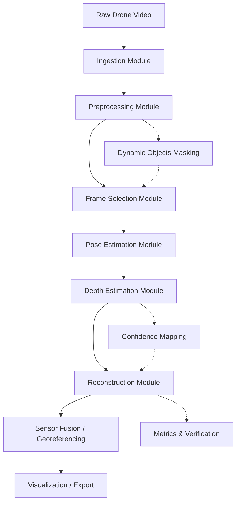

# System Architecture

This document describes the modular architecture of the **SIH26158 Single-Pass Drone Video to 3D Model Generation System**.

## System Overview

The system is designed as a sequential, modular pipeline where each module has a distinct responsibility. This modular design allows us to swap individual algorithms (e.g., swapping COLMAP for deep pose estimators, or standard MVS for 3D Gaussian Splatting) without rewriting the entire pipeline.

---

## Component Breakdown

### 1. Ingestion (`src/ingestion`)
* **Role**: Ingests raw video files and associated telemetry (GPX, KML, EXIF tags, CSV).
* **Output**: Set of raw frames and structured flight metadata.

### 2. Preprocessing (`src/preprocessing`)
* **Role**: Enhances image quality, applies lens distortion correction, and runs deblurring algorithms.
* **Output**: Cleaned, uniform, undistorted frames.

### 3. Frame Selection (`src/frame_selection`)
* **Role**: Filters out redundant, static, or low-quality frames. Retains a subset of high-quality "keyframes" optimizing spatial baseline coverage.
* **Output**: Curated list of keyframes.

### 4. Pose Estimation (`src/pose`)
* **Role**: Calculates camera intrinsics and extrinsics (trajectories). Interfaces with Structure-from-Motion (SfM) libraries like COLMAP or deep trajectory estimators.
* **Output**: Camera poses for all selected keyframes.

### 5. Depth Estimation (`src/depth`)
* **Role**: Computes dense depth maps from the keyframes. Can use traditional stereo matching or deep neural networks (e.g., Depth Anything, MiDaS).
* **Output**: Depth maps per keyframe.

### 6. Reconstruction (`src/reconstruction`)
* **Role**: Generates the final 3D representation by fusing depth maps and color frames. Techniques include TSDF fusion, Poisson surface reconstruction, NeRFs, or 3D Gaussian Splatting.
* **Output**: 3D Point Clouds, Meshes, or Neural/Splat assets.

### 7. Sensor Fusion (`src/sensor_fusion`)
* **Role**: Merges drone telemetry (GPS, IMU, altimeter) with the reconstructed 3D space to resolve absolute scale and orientation.
* **Output**: Georeferenced, scaled 3D model.

### 8. Dynamic Objects (`src/dynamic_objects`)
* **Role**: Detects and segments moving elements (cars, people, wind-blown foliage) to mask them out from the reconstruction.
* **Output**: Mask images corresponding to each keyframe.

### 9. Occlusion Handling (`src/occlusion`)
* **Role**: Identifies occluded regions and coordinates fill-in strategies or confidence adjustments.

### 10. Confidence Mapping (`src/confidence`)
* **Role**: Assigns per-pixel or per-point confidence scores to guide the fusion and meshing processes.

### 11. Metrics & Evaluation (`src/metrics`)
* **Role**: Computes statistical errors, checks geometric consistency, and measures accuracy against ground truth datasets.

### 12. Visualization (`src/visualization`)
* **Role**: Renders the 3D model and trajectory for user review and validation.
